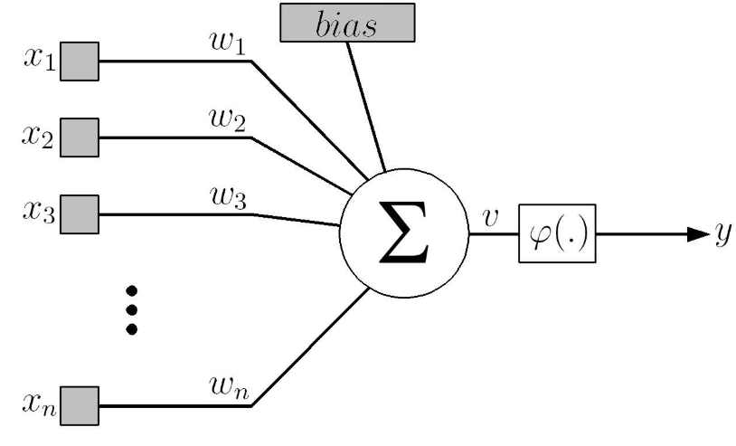
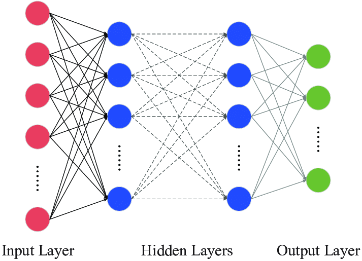

# Rede Neural Supervisionada

## Objetivo

O projeto foi desenvolvido em cima do dataset [csgo_round_snapshots.csv](db/csgo_round_snapshots.csv), que contem aproximadamente 700 exemplos de torneios de alto nível de CS:GO no período entre 2019 e 2020.

A função desta rede neural é ser capaz de prever qual time (Terroristas ou Contraterroristas) vencerá a rodada da partida, jogada em uma melhor de 30 rodadas.

Utilizamos os dados relativos à quantidade de jogadores vivos em cada time, a vida total dos jogadores de cada time, o dinheiro em USD de cada time, o tempo restante no final do round e se a bomba foi plantada, além do time que venceu a rodada.

## Instruções

O projeto consiste em desenvolver um modelo de rede neural supervisionado (rede MLP) para um problema de classificação ou de regressão. Considerar:

- Modelos com diversos hiperparâmetros (número de camadas, número de neurônios, etc.) devem ser avaliados (mínimo de 5 modelos distintos);

- O modelo deve ser treinado com o algoritmo de retropropagação tradicional (SGD - Stochastic Gradient Descendent);

- O dataset deve ser não trivial (não-linear). Considere datasets com pelo menos 5 atributos (features) e no mínimo 200 exemplos;

- O conjunto deve ser dividido entre treino, validação e teste. Considerar 80/10/10%, respectivamente. Aleatorizar antes de separar os conjuntos;

- O modelo com melhor resultado deve retreinado com o termo de momentum.

## Revisão Teórica

Para o desenvolvimento da rede, será utilizado o método de aprendizagem por **[correção de erro](#correção-de-erro)** sob o paradigma do **[aprendizado supervisionado](#aprendizado-supervisionado)**, conforme informado nas instruções do projeto.

O [**perceptron**](#perceptron), base da arquitetura MLP, é a associação de um algoritmo de aprendizagem ao neurônio MCP, ou seja, nos permite um ajuste automático dos pesos através dos erros calculados pela correção de erro. Contudo, apenas um perceptron nos fornece uma única camada de neurônios com pesos ajustáveis. Como temos um dataset com mais de 5 features, ou seja, um problema não-linear, esse modelo não é suficiente para modelar o problema proposto. 

Então, usaremos a arquitetura [**multilayer perceptron (MLP)**](#mlp), que consiste na disposição de múltiplas camadas de perceptrons. Como não temos acesso direto aos pesos das camadas ocultas, utilizaremos um algoritmo de retropropagação pelo método de gradiente descendente estocástico para atualizar esses pesos.

### Correção de Erro

Os dados (dataset) são fornecidos à rede neural no formato $\{(x_k, d_k)\}^N$, em que $x_k$ são features e $d_k$ são labels (respostas esperadas). Esse formato de dataset cumpre o papel do professor no método de aprendizado, por fornecer as respostas desejadas. A rede, por sua vez, produz uma resposta $y_k$ de acordo com o dado de entrada.

A partir das respostas ($d_k$ e $y_k$), calculamos um **sinal de erro** ($e_k$) a fim de reduzir o erro ao longo do processo de treinamento:

$$
e_k(n) = d_k(n) - y_k(n)
$$

Sendo **n** o número do passo da atualização dos pesos no processo de aprendizado.

Conforme orientado nas instruções do projeto, utilizamos o **gradiente descendente** para processar o erro encontrado e reduzí-lo na próxima iteração do aprendizado.

#### **Gradiente Descendente**

Podemos representar a função de custo, ou energia, pelo erro quadrático médio sobre o conjunto de treinamento:

$$
E(n) = \frac{1}{2}\sum(d_k(n) - y_k(n))^2
$$

ou

$$
E(n) = \frac{1}{2}\sum(e_k(n))^2
$$

Para minimizar essa função, ou seja, reduzir o erro a cada iteração, aplicamos o gradiente descendente, ou regra delta, definido por:

$$
\Delta w_{kj} = -\eta \frac{\partial{E}}{\partial{w_{kj}}}
$$

Em que $w_{kj}$ é o peso entre os neurônios $k$ e $j$, e $\eta$ é a taxa de aprendizagem da rede.

Esse método nos garante a aproximação de um mínimo na função pelo cálculo do negativo do valor do gradiente da função, que indica uma direção de minimização da função.

Vale ressaltar que esse método, por si só, não garante que chegaremos a um mínimo global. Seria necessária a aplicação de métodos, como o [**termo de momentum**](#termo-de-de-momentum), para garantir que podemos sair de mínimos locais e encontrar mínimos globais, bem como decair o nível de energia mais rapidamente.

### Aprendizado Supervisionado

Este paradigma consiste no fornecimento de **dados tabelados** ($\{(x_k, d_k)\}^N_{i=1}$) à rede neural, ou seja, o modelo sabe previamente a classificação da amostra durante a fase de treinamento. Dessa forma, não é necessária a busca por regularidades estatísticas nos dados a fim de adaptar-se ao problema descrito.

No contexto desse modelo, estamos avaliando um caso de classificação binária, em que esse tipo de paradigma de aprendizado é comumente aplicado.

### Perceptron

O perceptron, proposto por Frank Rosenblatt em 1958, é construído em torno do **neurônio MCP**, em que os pesos são representados por $w_1, w_2, ..., w_n$, as entradas por $x_1, x_2, ..., x_2$, o bias externo por $b$ e o campo local induzido (não-linear) por

$$
v = \sum_{i=1}^{n}w_ix_i + b
$$

*(Modelo de neurônio de McCulloch e Pitts)*

Esse tipo de neurônio, bem como o MLP, assume apenas saídas binárias, aplicado em casos de aprendizado supervisionado via correção de erros.

#### **Atualização dos pesos**

Alteramos os pesos apenas quando o padrão retornado pelo neurônio não é igual ao esperado. A atualização segue a equação

$$
w(n+1) = w(n) + \eta[d(n) - y(n)]x(n) \Longleftrightarrow \Delta w = \eta e(n)x(n)
$$

A atualização dos pesos é aplicada até que o modelo atinja uma precisão satisfatória.

Algoritmo:

1. Iniciamos os pesos sinápticos com valores aleatórios pequenos;
2. Aplicamos na entrada uma amostra aleatória do banco de dados com seu respectivo valor desejado $d_j$ e verificamos a saída $y_k$ gerada pelo neurônio;
3. Calculamos o erro $e_j$;
4. Se $e_j = 0$, retornamos ao passo 2;
5. Senão, atualizamos os pesos;
6. Retornamos ao passo 2.

Contudo, pelas saídas estritamente binárias, esse modelo é insuficiente para modelar problemas não triviais. Para representar funções que não são linearmente separáveis, utilizamos mais de uma camada de perceptrons, ou seja, o **multilayer perceptron**.

### MLP

Ao associar múltiplas camadas de perceptrons, divididas em camada de entrada, camadas ocultas e camada de saída, superamos a restrição do perceptron indiviual. Múltiplas camadas permitem que transformemos um problema não-linearmente separável em um linearmente separável (camada a camada).

*(Multilayer perceptron)*

Contudo, isso gera outro problema, que é o acesso aos pesos sinápticos das camadas internas do neurônio. Isso ocorre porque, ao propagar um sinal pela rede neural, os erros de cada camada se acumulam na saída da rede, fornecendo uma ideia pouco nítida dos erros de cada camada do MLP.

Para resolver isso, foi proposto o popular **algoritmo de retropropagação**, baseado na método de aprendizagem por correção de erro. Esse algoritmo consiste em duas etapas: a propagação (feedforward), com pesos fixos, e a retropropagação (feedback), que atualiza os pesos conforme seu efeito se propaga.

Na propagação, a resposta da rede é subtraída da resposta desejada, gerando um sinal de erro. Na retropropagação, esse sinal de erro é propagado para trás, ajustando os pesos sinápticos a fim de aproximar a resposta obtida da desejada.

O cálculo do gradiente local é feito da seguinte maneira:

$$
\Delta w_{kj} = -\eta \frac{\partial{E}}{\partial{w_{kj}}} = -\eta \frac{\partial{E}}{\partial{v_{k}}}\frac{\partial{v_k}}{\partial{w_{kj}}}
$$

$$ 
\begin{cases}
-\frac{\partial{E}}{\partial{v_{k}}} = \delta_k \ \hbox{(gradiente  local)} \\
v_k = \sum w_{kj}x_j \Longrightarrow \frac{\partial{v_k}}{\partial{w_{kj}}} = x_j
\end{cases} \Longrightarrow
\Delta w_{kj} = \eta \delta_k x_j
$$

 (Retropropagação) 

(desenvolver explicação disso)

Tomamos o gradiente local como

$$ \delta_k = -\frac{\partial{E}}{\partial{v_{k}}} = -\frac{\partial{E}}{\partial{y_{k}}}\frac{\partial{y_k}}{\partial{v_k}} $$

Assumindo $y_k = f(v_k)$, temos

$$
\delta_k = -\frac{\partial{E}}{\partial{y_{k}}}\frac{\partial{y_k}}{\partial{v_k}} = -\frac{\partial{E}}{\partial{y_{k}}}f'(v_k) \ \hbox{, em que} \ \frac{\partial{E}}{\partial{y_{k}}} \ \hbox{depende da posição do neurônio.}
$$

Para um neurônio de saída, o erro é o mesmo do calculado para na função de energia. Logo,

$$
\frac{\partial{E}}{\partial{y_{k}}} = \frac{\partial{}}{\partial{y_{k}}} \left(\frac{1}{2} \sum(d_k(n) - y_k(n))^2 \right) = -e_k \Longrightarrow \\
\Longrightarrow \delta_k = e_k f'(v_k) \ \hbox{(gradiente local do neurônio de saída)}
$$

Já para um neurônio $k$ oculto, devemos entender que o estado interno de $k$ depende do neurônio $j$ da camada anterior, seja em menor ou maior grau. Assim, 

#### **Termo de de Momentum**

Analogamente à Mecânica, aplicamos o momento linear na descida do gradiente. Dessa forma, geramos inércia na descida, permitindo que, dependendo da velocidade, o gradiente ultrapasse o ponto de mínimo local e decaia para outra região do gráfico de energia, com menor valor.

(possivelmente inserir imagem do momentum aqui)

## Dataset

## Desenvolvimento