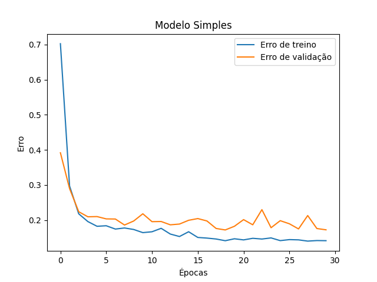
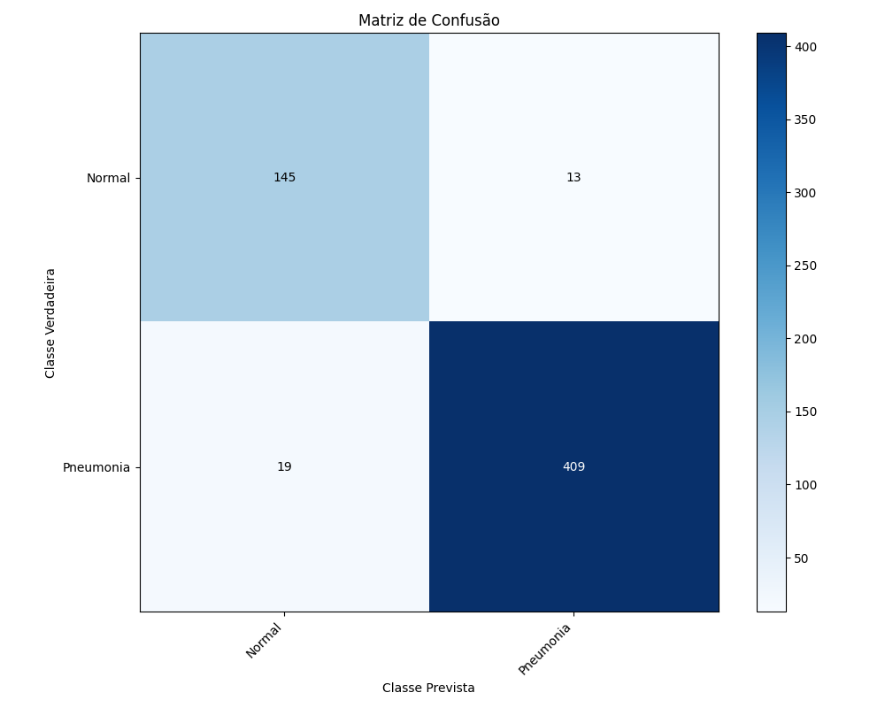
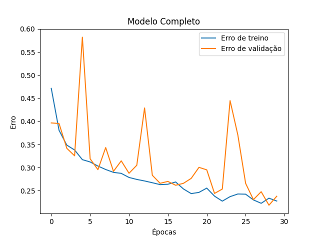

# Desenvolvimento de modelos de redes neurais convolucionais para o diagnóstico de casos de pneumonia infantil através de imagens de radiografias torácicas.


**Discente**: Gabriel Delgado Panovich de Barros - 176313  
**Disciplina**: Introdução às Redes Neurais Artificiais (UNIFESP)

## 📝 Resumo

A implementação de algoritmos para o apoio à decisão clínica, como diagnóstico por imagem, é um desafio fundamentado na complexidade de definição de métodos de confiabilidade para as saídas fornecidas por esses programas. O uso dessas ferramentas é essencial para automatizar processos onerosos, agilizando o acesso do paciente a tratamentos essenciais e, situacionalmente, urgentes. Este projeto visa fornecer uma abordagem para esse gargalo através de arquiteturas de Redes Neurais Convolucionais (CNNs), aplicadas à detecção de pneumonia em radiografias torácicas. Ao comparar modelos próprios com modelos de referência (estado da arte), utilizando técnicas de *Data Augmentation* para potencializar a generalização do modelo, busca-se atingir uma arquitetura que equilibre custo e precisão, de modo que as aplicações do modelo sejam viáveis no diagnóstico por imagem. **(adicionar resultados)**

## Sobre o programa

### Project Tree

```bash
📂 Projeto_Final/
├──assets/
│   ├──Complete_CNN_ConfusionMatrix.png
│   ├──Complete_CNN_Losses.png
│   ├──Simple_CNN_ConfusionMatrix.png
│   └──Simple_CNN_Losses.png
├──models/
│   ├──res_net.py
│   └──simple_cnn.py
├──notebooks/
│   └──tests_notebook.ipynb
├──utils/
│   ├──load_data.py
│   ├──show_data.py
│   └──view_loss.py
├──README.md
├──main.py
└──requirements.txt
```

### 🚀 Como Executar
**Pré-requisitos**

Certifique-se de ter o Python instalado. É recomendado utilizar um ambiente virtual (venv ou conda).

#### 1. Clone o repositório

```bash
git clone https://github.com/gabrieldpbarros/Artificial-Neural-Networks.git
cd Projeto_Final
```

#### 2. Instale as dependências

```bash
pip install -r requirements.txt
```

#### 3. Obtenção dos dados

O projeto utiliza o dataset "Chest X-Ray Images (Pneumonia)". Baixe-o do Kaggle manualmente e extraia na pasta db/ (ou ajuste o caminho PATH no main.py) ou rode o programa normalmente, pois possui um condicional que verifica se o dataset foi baixado, fazendo esse processo caso não.

#### 4. Execute o treinamento

```bash
python main.py
```

## 📊 Análise de Resultados

O projeto comparou duas arquiteturas principais:

#### 1. Modelo Baseline (Simples): 2 Blocos Convolucionais, sem Dropout.

#### 2. Modelo Proposto (Complexo): 3 Blocos, com Batch Normalization, Dropout e GAP.

|      Modelo       |Acurácia|Sensibilidade (Recall)|F1-Score|
|-------------------|--------|----------------------|--------|
|Baseline (Simples) | 94.54% |        95.56%        | 96.24% |
|Proposto (Complexo)| 90.96% |        92.76%        | 93.74% |

Visualização de Desempenho
Modelo Simples (Vencedor)

<p float="left"> 
     
     
</p>

Nota-se a convergência rápida e estável (esquerda) e o baixo número de Falsos Negativos (19 casos) na matriz de confusão (direita).
Modelo Complexo (Instável)

<p float="left"> 
     
     
</p>

Observa-se alta volatilidade na validação (esquerda) indicando dificuldade de generalização, resultando em desempenho inferior.

## 🛠️ Tecnologias Utilizadas
- Linguagem: Python 3
- Deep Learning: PyTorch
- Processamento de Dados: NumPy, Pandas
- Visualização: Matplotlib, Seaborn
- Métricas: Scikit-learn

## 📚 Referências

[1] Kermany, Daniel S., et al. "Identifying medical diagnoses and treatable diseases by image-based deep learning." Cell 172.5 (2018).

[2] Mooney, P. "Chest X-Ray Images (Pneumonia)." Kaggle (2018).